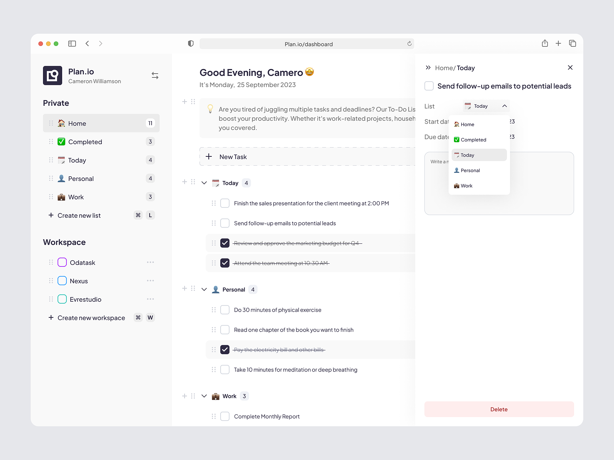

### todolist

#### 待完善功能

ui参照：https://dribbble.com/shots/23668199-Planio-Detail-Task

1、导入，使用表格进行导入，导入之后转成json格式，方便后续操作
2、导出，将本地的数据导出为Excel表格，可再次导入
3、对于todoList的增删查改都要修改本地数据
4、可以修改todoList
5、查询，根据条件查询数据

6、左边还是要搞一个分组，可以分组为当前要做的，未来要做的
7、类型里要有分组信息groupId，groupName
8、分组可以拖动顺序，不能有子分组
9、分组增删查改，左边图标
10、每一个todo可以添加自定义标签

